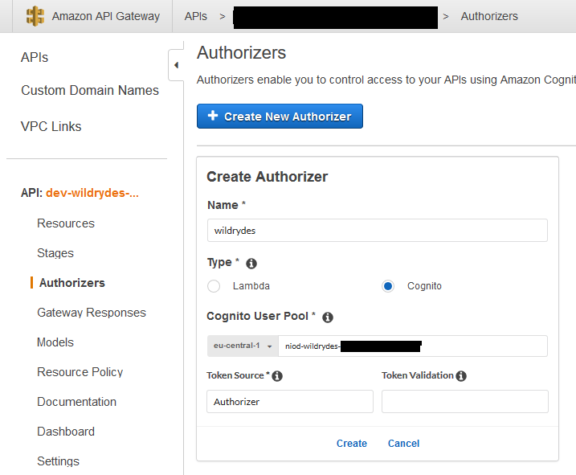
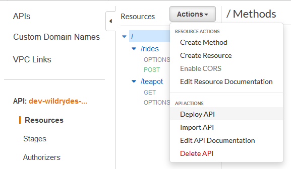

# Serverless Wildrydes example
This repository contains a serverless template to setup the fullstack application from the AWS wildrydes example: https://aws.amazon.com/getting-started/hands-on/build-serverless-web-app-lambda-apigateway-s3-dynamodb-cognito/

If you are new to AWS and serverless it is advised to follow the aforementioned AWS tutorial first by hand. Afterwards, the serverless.yml file should be easier to understand.

It creates the following services:
- S3 storage
- API Gateway
- Lambda function
- Cognito User Pool

## Setup
These instructions assume you have installed the serverless framework CLI.
Clone the repository, open the file serverless.yml and replace the following variables with your values:
service: YOUR_SERVICE
app: YOUR_APPNAME
org: YOUR_ORG
region: YOUR_REGION
stage: dev
prefix: YOUR_PREFIX

Afterwards, navigate to the new folder and runn "serverless client deploy" and "serverless deploy" to create the frontend and backend. Note that 
After deploying the service, the user pool id, client id and region must be updated in the src/frontend/js/cognito-auth.js file and the client redeployed to .

## Known issues
At the moment, the authorizer in the API Gateway must be manually added. To proceed, you need to know the name of your Cognito pool. The name follows the pattern `${prefix}-${self:service}-user-pool-client`, substitute prefix and service with the values you provided. Navigate to the API Gateway service, locate the API for your project and then select Authorizer in the left-hand side. Click Ad new and enter the name of the new user pool, select "Cognito" as authorizer type and choose "Authorization" for token source.

Afterwards, redeploy the API by clicking deploy in the Resources tab

## Removal
The cleanup the created services by the template, use "serverless remove". Keep in mind that you are responsible to verify if all resources have indeed been removed on AWS. There is no guarantee for trailing services that cause costs.